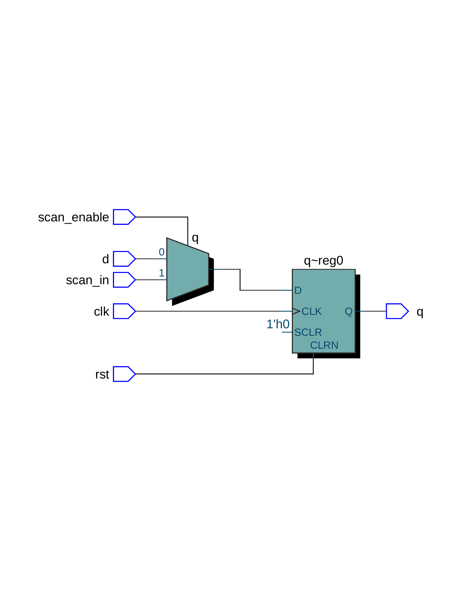
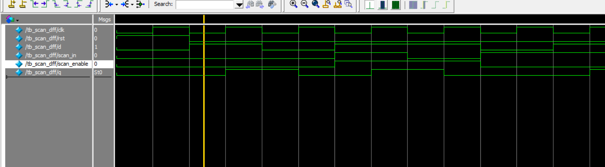

# 🔍 DFT Practice — Scan D Flip-Flop

This project demonstrates a simple scan-enabled D Flip-Flop design with Verilog, including RTL implementation, testbench verification, and waveform simulation using ModelSim.

---

## 🧠 Design Description

A **Scan D Flip-Flop** adds scan functionality for Design for Testability (DFT). When `scan_enable = 1`, the value of `scan_in` is loaded into the flip-flop instead of the regular data input `d`. This design allows for controllable test patterns to be shifted into sequential elements during scan mode.

---

## 📐 RTL Diagram

Generated using **Quartus Prime Lite 18.0**:

---

## ⏱ Simulation Waveform

Simulated with **ModelSim - Intel FPGA Starter Edition 10.5b**:

---

## 🛠 Toolchain

- Quartus Prime Lite 18.0
- ModelSim - Intel FPGA Starter Edition 10.5b

---

## 📁 Folder Structure

- `scan_dff.v`：Scan D Flip-Flop 的 Verilog RTL 程式碼
- `tb_scan_dff.v`：Testbench，模擬用來驗證設計的輸入與行為
- `RTL_scan_dff.png`：由 Quartus 產生的 RTL 結構圖
- `wave_tb_scan_dff.png`：由 ModelSim 產生的模擬波形圖

---

## ✍️ Author

Huichingchang  
April 2025
